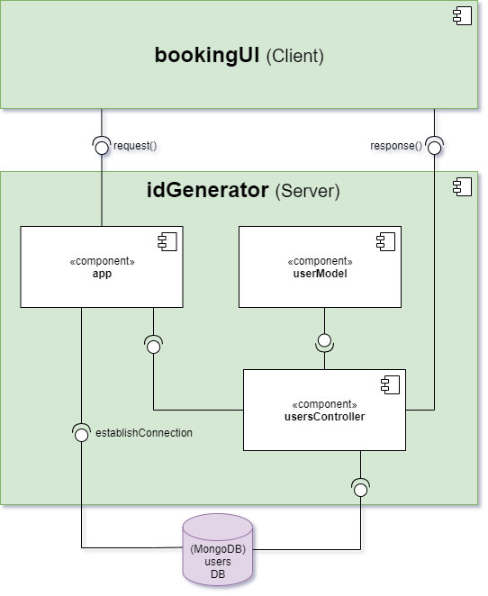

# idGenerator

## Project setup

### Prerequisites

- Install the dependency packages from npm
``` 
npm install
```

### Run the service
```
npm run dev
```
## Diagrams

### Low-level idGenerator component diagram

